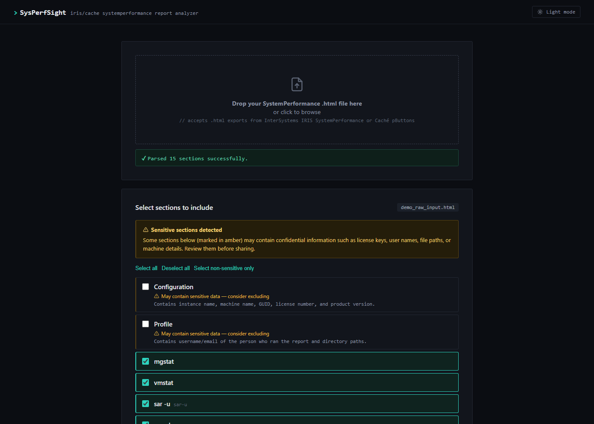
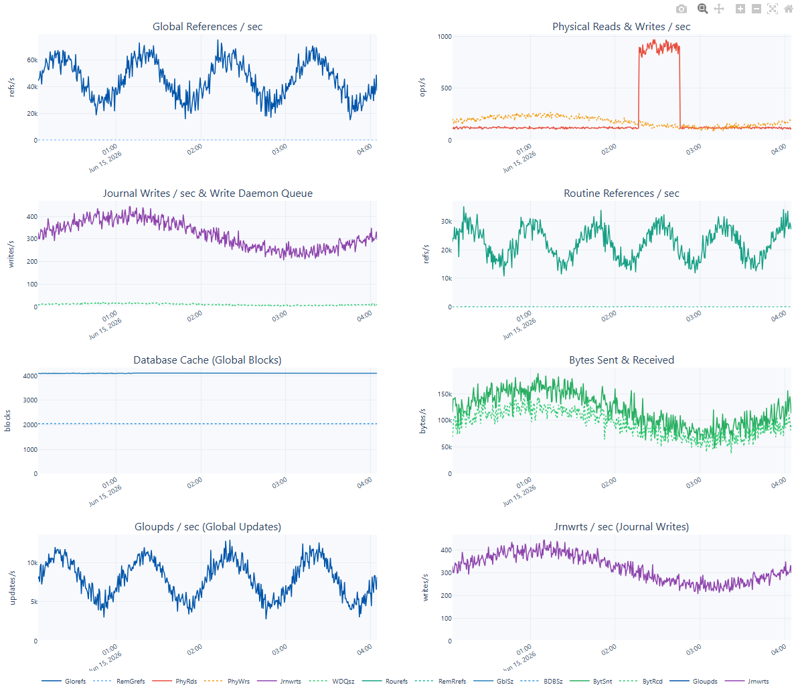

# `> SysPerfSight`

A web tool for analyzing InterSystems IRIS SystemPerformance HTML reports (and older Caché pButtons reports — Windows and Linux). Upload a report, choose which sections to keep, and download a clean analyzed copy — with inline charts, insights, and cross-section synthesis — without sharing data you didn't intend to.

Pick your sections, and sensitive ones are flagged automatically:



Selected sections get charts injected above the raw data:



...and plain-language insights that call out what's worth a second look:


## Features

- **100% local processing — your file never leaves your machine.** The tool runs entirely on your own computer. All parsing is done in-process using Python's standard library (`re`). The three dependencies (FastAPI, Uvicorn, python-multipart) are server/parsing primitives that make no outbound network calls. The server binds to `127.0.0.1` (loopback only), so even the traffic between your browser and the tool stays within your machine's network stack. No data is sent to any cloud service or AI.
- Drag-and-drop upload of SystemPerformance `.html` files
- All sections detected and listed automatically
- Sensitive sections (license keys, usernames, file paths, machine details) are flagged and **pre-deselected** with explanations
- One-click "Select non-sensitive only" filter
- Excluded sections keep their header and nav anchor — replaced with a clearly marked placeholder so the file remains well-formed and shareable
- Optional time range filter to slice time-series sections (mgstat, vmstat, sar, iostat)
- Time-series charts carry dashed threshold reference lines (e.g. 70%/40% disk %util, 1 ms latency, 80% CPU busy) matching each chart's own insight thresholds, so the "is this bad?" line is visible at a glance
- When a CPF file is included, disk-saturation insights cross-reference its declared database/journal/WIJ paths against the actual disk layout (Linux `mount`, Windows drive letters) and scope warnings to the disks that actually matter to IRIS — a spike on an unrelated OS disk won't trigger a false alarm
- **Three export modes** for different sharing needs:
  - **Full report** — charts, insights, raw data, cross-section synthesis, and sensitive-data banners
  - **Charts + Raw** — charts plus raw data (collapsed); no insights or synthesis
  - **Charts only** — charts only; no raw data, no insights; excluded sections hidden entirely
- Output filename auto-populated from the source file name + upload timestamp

## Running with Docker (recommended)

Requires [Docker](https://docs.docker.com/get-docker/).

```bash
docker run -p 8765:8765 --name sysperfsight ghcr.io/asinay/sysperfsight
```

If port 8765 is already in use, pick any free port (e.g. 8080):

```bash
docker run -p 8080:8765 --name sysperfsight ghcr.io/asinay/sysperfsight
```

Or build and run locally:

```bash
docker build -t sysperfsight .
docker run -p 8765:8765 --name sysperfsight sysperfsight
```

Using Docker Compose:

```bash
docker compose up
```

Open http://localhost:8765 in your browser.

## Setup (without Docker)

Requires Python 3.9+.

```bash
python -m venv venv
./venv/Scripts/pip install -r requirements.txt   # Windows
# source venv/bin/activate && pip install -r requirements.txt  # macOS/Linux
```

```bash
./venv/Scripts/uvicorn app:app --host 127.0.0.1 --port 8000
```

Open http://127.0.0.1:8000 in your browser.

## Sensitive sections

The following sections are flagged and deselected by default:

| Section | Why it's sensitive |
|---|---|
| Configuration | Instance name, machine name, GUID, license number |
| Profile | Username/email of report author, directory paths |
| License | License type, user counts, feature codes |
| CPF file | Full filesystem paths for all databases and namespaces |
| IRIS ALL | All IRIS instances on the machine with ports and directories |
| Windows info | OS, hardware, and network configuration details |
| tasklist | All running processes on the machine |

## Analyzers

Selected sections with an analyzer get inline charts and insights injected above their raw data:

| Section | What it produces |
|---|---|
| mgstat | Global refs, physical I/O, journal writes, WD phase, routine cache, network charts; stat cards; NSeize/ASeize contention and WD saturation insights |
| %SS | Process type breakdown, TCP trend, top-CPU/Glob tables, namespace and top-routine breakdowns; insights |
| vmstat | Run queue, swap I/O, CPU breakdown, block I/O charts; stat cards; insights; reference lines for run-queue and CPU-busy thresholds |
| sar -u | Stacked CPU area chart (user/sys/iowait/steal + idle); stat cards; saturation/steal/iowait insights; reference lines for %CPU-used thresholds |
| sar -d | %util, tps, throughput, r/w latency, queue depth charts; per-device summary table; insights; reference lines for %util and latency thresholds |
| iostat | %util, CPU iowait, IOPS, throughput, latency charts; insights; reference lines for %util, iowait, and latency thresholds |
| free | RAM usage, adjusted free RAM trend, swap used charts; stat cards; memory pressure insights |
| irisstat -D | Lock contention summary and per-second rates tables (sortable); block collision insights |
| irisstat -R | Routine buffer pool: in-use routines, top packages by buffer count, type breakdown; class LRU eviction insights |
| sysctl -a | Compliance table for IRIS-relevant kernel parameters (sortable); red/amber/green status; tuning insights |
| ps | Process snapshot: RSS by user chart, top-15 by RSS table, IRIS job-type breakdown; D-state insights |
| df -m | Disk usage stacked bar chart; full filesystem table with colour-coded Use% badge; capacity insights |
| mount | Local and network filesystem tables (sortable); soft-mount and NFS sync insights |
| cpu | CPU topology summary cards |
| Windows info | OS/hardware summary cards |
| tasklist | Top processes by memory |
| perfmon | CPU utilization, processor queue, available memory, paging, network throughput charts; disk %busy/queue/IOPS/throughput/latency charts broken out **per physical drive**; insights and reference lines to match |
| CPF file | Database configuration, namespace mappings, and key parameter summary |

## Troubleshooting: "No sections found"

The parser locates sections with a couple of regexes matched against exact
HTML tag scaffolding (`<hr size="4" noshade>`, `<div id=...>`). If an upload
comes back with a 0-section error, the report's markup differs from every
variant the parser currently knows about.

Run `diagnose_report.py` against the file to see why, without exposing any
of the actual report data:

```bash
python3 diagnose_report.py path/to/report.html
```

It prints only the HTML tag scaffolding around section boundaries — never
the contents of a `<pre>` block, which is where hostnames, paths, and other
sensitive data live. That output is safe to paste into a bug report. See the
script's docstring for options (`--max`, `--context`, `--max-len`).

## Project structure

```
app.py                  FastAPI backend (upload + export endpoints)
sysperfsight_parser.py  HTML parsing and section reconstruction logic
diagnose_report.py      Standalone diagnostic for "No sections found" failures
static/index.html       Single-page frontend (no build step)
analyzers/              Per-section analysis modules
requirements.txt        Python dependencies
outputs/                Generated filtered files
```
